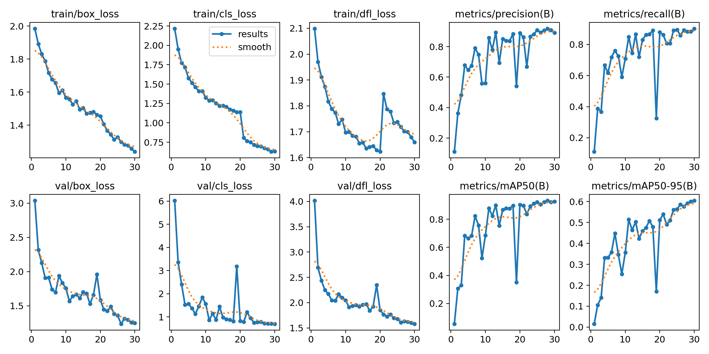
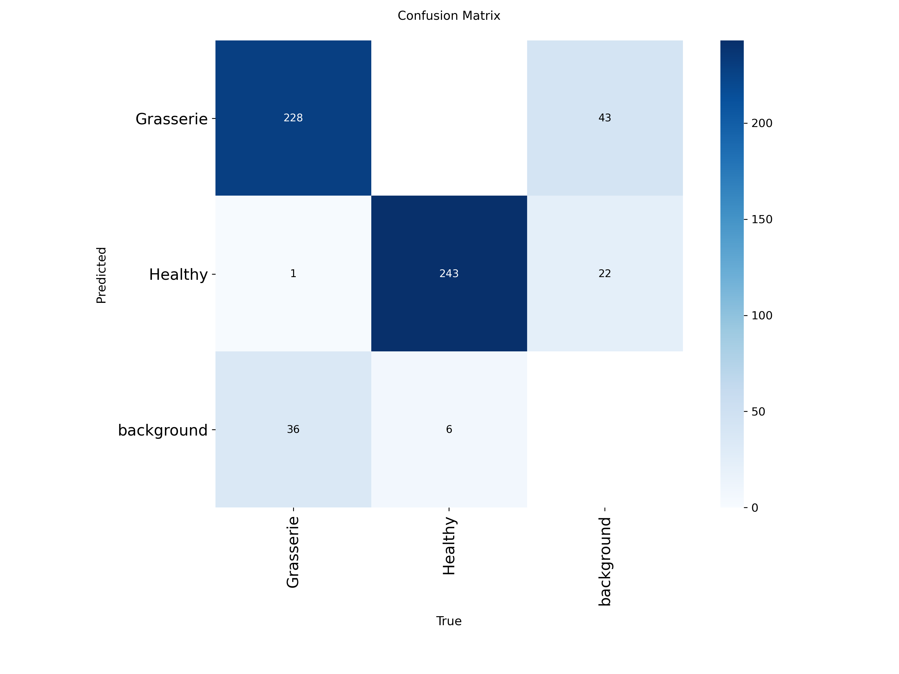

# SilkGuard

SilkGuard is a machine learning pipeline and web application that detects diseases in silkworms and mulberry leaves. It uses YOLOv8 for detection, FastAPI for the backend, and MLflow for tracking.

## Features

- YOLOv8 model for disease identification
- FastAPI web API
- Javascript/CSS frontend
- MLflow tracking for experiments
- DVC for data versioning
- Pre-configured Jupyter notebooks for Colab

## Setup

1. Clone repo and setup env:
```bash
git clone https://github.com/sanjanakamat/silkguard.git
cd silkguard
python -m venv venv
source venv/bin/activate  # Windows: venv\Scripts\activate
pip install -r requirements.txt
```

2. Run the application:
```bash
uvicorn src.main:app --reload
```
Go to `http://localhost:8000`.

3. View MLflow:
```bash
mlflow ui
```
Go to `http://127.0.0.1:5000`.

## Model Performance

The custom YOLOv8 model was trained for 30 epochs:

- mAP50: 92.6%
- Precision: 89.1%
- Recall: 90.3%

### Training Results


### Confusion Matrix


## Training

To retrain:
1. Pull data: `dvc pull`
2. Train: `python src/pipelines/train.py`

Or use `notebooks/colab_training.ipynb` in Google Colab.
